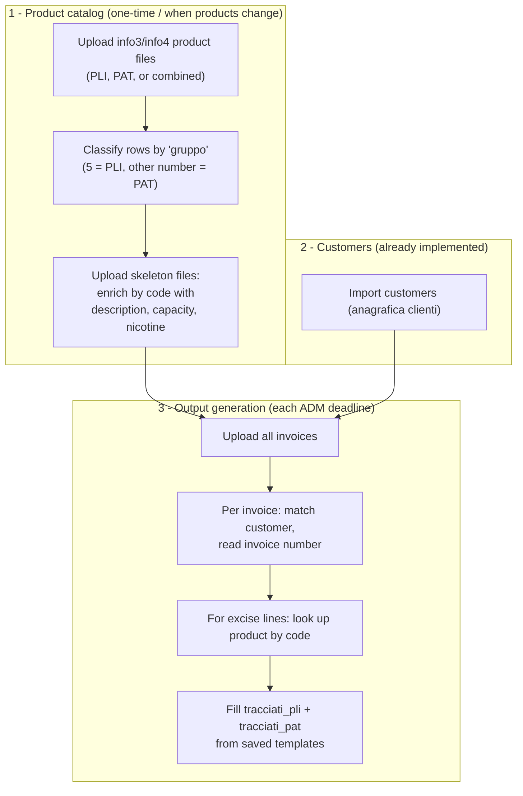

# PLI PAT Schema Builder

Offline **desktop** application that helps a single company fill in the fixed-structure
Excel files it must send to the Italian **Agenzia delle Dogane e dei Monopoli (ADM)**
(Customs and Monopolies Agency) for the sale of:

- **PLI** – *Prodotti Liquidi da Inalazione* (inhalation liquid products / e-liquids)
- **PAT** – *Prodotti Accessori dei Tabacchi* (tobacco accessory products)

Twice a month (the 15th and the end of the month) the ADM requires summary
spreadsheets (*prospetti*) that follow an **immutable, cell-by-cell template**. The app
produces those Excel files ready to be submitted.

**Intended workflow:**

1. (Once, or whenever they change) enter **products** and **customers**.
2. At each deadline, upload the **invoices**; the app runs the calculations and returns
   the ready-to-send **Excel files**.

> **Scope:** this is a bespoke tool for *this* company's file structure — it is not meant
> to be generic or multi-tenant. It runs fully **offline** on the desktop, and the ADM
> template structure must be reproduced exactly, formulas included.

Built with [Tauri v2](https://tauri.app/) (Rust), [SvelteKit](https://svelte.dev/docs/kit)
(Svelte 5 runes), and [Tailwind CSS v4](https://tailwindcss.com/).

> For contributor/agent conventions and a deeper architecture breakdown, see
> [CLAUDE.md](CLAUDE.md).

---

## Workflow

The application has three phases: build the **product catalog**, import **customers**, then
at each ADM deadline upload the **invoices** and generate the two output spreadsheets
(*tracciati*).



### 1. Product catalog setup (one-time, or whenever products change)

1. The user uploads the product list in the **info3/info4** structure — one file for **PLI**,
   one for **PAT**, or a **single file containing both**.
2. PLI and PAT rows are distinguished by the **`gruppo`** column: value **`5`** = PLI, any
   **other number** = PAT. A row with **no number** in `gruppo` is **ignored**.
3. From these files the app stores the product **`code`**, **`units`**, and **`packages`**:
   for PAT, `units` come from the **info4** column and `packages` from the **info3** column.
   The **description does *not* come from these files** — it comes from the skeleton files
   (next step).
4. The user then uploads the **skeleton files** (`skeleton_pli`, `skeleton_pat`). Matching on
   the **product code**, the app fills in the **`description`** (both PLI and PAT), the
   **`capacity`** + **`nicotine`** (PLI only), the **`admCode`** and **`tabella`** (PAT only —
   written to `tracciati_pat` columns L and K). Import owns `{units, packages}` and the skeleton
   owns `{description, capacity, nicotine, admCode, tabella}`, so a re-import never wipes skeleton
   data. (`gruppo` only classifies PLI vs PAT at import; the persisted `tabella` value comes from
   `skeleton_pat`.)

The import (`service/product::upload_products_excel`) leaves the skeleton-owned fields **NULL**;
uploading the skeletons then fills the real values (`service/product::upload_skeleton_excel`). A
product still missing its skeleton data is **incomplete** (PLI lacking capacity/nicotine, PAT
lacking admCode): it is tagged in the products table and **skipped** during tracciati generation
(reported as a warning) — see `Product::is_skeleton_complete`.

### 2. Customers

Customer import is **already implemented** — see
[`src-tauri/src/service/customer.rs`](src-tauri/src/service/customer.rs) and
[`src/routes/customers/+page.svelte`](src/routes/customers/+page.svelte).

### 3. Output generation (each ADM deadline)

Each time an output is needed, the user uploads **all the invoices**. The app produces two
files by filling the saved templates **`tracciati_pli`** and **`tracciati_pat`**. For each
invoice:

1. **Find the customer** — first by **fiscal code**, otherwise by **VAT number**.
2. **Read the invoice number** from column **AN** (usually cell **`AN18`**). It must be an
   **integer** — otherwise return an error.
3. Take **only the invoice lines that have a value in the `Accise` (excise) column**. For
   each such line, read the product **`code`** from the **`Articolo`** column and look up the
   matching product row in the database.
4. Write the line into the right *tracciato*:
   - **PLI** → `tracciati_pli`: **`numero di confezioni` = product `units` × line `quantity`**.
   - **PAT** → `tracciati_pat`: **`N° confezioni immesse in consumo` = product `packages` × line `quantity`**.
5. **`CMNR Rivendita generi di monopolio`** = the customer's tax code **only when** the
   customer `typology` is **`RIVENDITA`**; otherwise it is left **empty**. For PLI, the tax
   code goes in a **separate dedicated column**.

> Implemented in `service/excel::generate_tracciati` (one user-selected period per run is written
> to every row). See [Status](#status) for what still needs verifying against the real templates.

---

## Stack

| Layer            | Technology                                                        |
| ---------------- | ----------------------------------------------------------------- |
| Desktop shell    | **Tauri v2** (Rust)                                               |
| Frontend         | **SvelteKit** (Svelte 5, runes) + **Tailwind CSS v4**             |
| Adapter          | `@sveltejs/adapter-static`, SSR off, `prerender = true`           |
| Database         | **SQLite** via `rusqlite` (`bundled` feature)                     |
| Excel read       | `calamine`                                                        |
| Excel write      | `rust_xlsxwriter`                                                 |
| Rust errors      | `thiserror`                                                       |

---

## Requirements

- [Node.js](https://nodejs.org/) 18+
- [Rust](https://www.rust-lang.org/tools/install) stable (1.77.2+)
- Tauri system dependencies – see the [Tauri prerequisites guide](https://tauri.app/start/prerequisites/) for your OS

## Getting Started

Install JavaScript dependencies:

```sh
npm install
```

### Development

Run the full desktop app in development mode (hot-reload):

```sh
npm run tauri dev
```

### Build

Compile a production release bundle:

```sh
npm run tauri build
```

### Type-check

```sh
npm run check          # svelte-check + sync
```

For the Rust backend: `cargo build` / `cargo clippy` inside `src-tauri/`.

---

## Project Structure

```
├── src/                          # SvelteKit frontend (UI)
│   ├── app.css                   # Tailwind CSS entry point
│   ├── lib/
│   │   ├── product-repository.ts  # typed invoke() wrappers, one module per domain
│   │   ├── customer-repository.ts
│   │   ├── page-actions.ts        # extractable/testable page logic (DI via ActionDeps)
│   │   └── index.ts               # $lib re-exports
│   └── routes/
│       ├── +layout.svelte         # root layout
│       ├── +layout.ts             # static adapter config (SSR disabled)
│       ├── +page.svelte           # home: invoice upload / processing
│       ├── products/+page.svelte  # product management
│       └── customers/+page.svelte # customer management
└── src-tauri/                    # Tauri / Rust backend
    ├── src/
    │   ├── controller/           # thin #[tauri::command] handlers
    │   ├── service/              # business logic, parsing & validation
    │   ├── repository/           # data access: SQLite + Excel I/O
    │   ├── utils.rs              # shared helpers (resolve_db_path, parse_i64)
    │   └── lib.rs                # command registration, startup table creation
    ├── capabilities/            # Tauri permission scopes
    └── tauri.conf.json          # app configuration
```

## Architecture

The Rust backend follows a three-layer pattern, one file per domain
(`product`, `customer`, `excel`):

- **controller/** – thin `#[tauri::command]` handlers; resolve the DB path, delegate, and
  convert errors at the boundary with `.map_err(|e| e.to_string())`.
- **service/** – business logic, Excel parsing, validation and transformations.
- **repository/** – data access: SQLite (`rusqlite`, async wrappers over `spawn_blocking`)
  and Excel I/O (`calamine` for reading, `rust_xlsxwriter` for writing).

The frontend uses one typed repository per domain (`src/lib/*-repository.ts`) wrapping
`invoke()`, with TS types mirroring the Rust structs in camelCase.

### Database schema

The SQLite file `pli_pat.db` lives in the app data directory and tables are created on
startup (`CREATE TABLE IF NOT EXISTS`).

| Table         | Notes                                                                      |
| ------------- | -------------------------------------------------------------------------- |
| `pli_product` | `code` UNIQUE, `description`, `units`, `capacity`, `nicotine`              |
| `pat_product` | `code` UNIQUE, `description`, `units`, `packages`                          |
| `customer`    | `tax_code` UNIQUE, `ordinal_number`, `typology` (CHECK), `vat_number`, `address`, `municipality_id` FK |
| `municipality`| `name` + `province_name`, UNIQUE(name, province_name)                      |

PLI and PAT are separate tables (PLI carries `capacity` + `nicotine`, PAT carries
`packages`) exposed to the frontend as a single `Product` type discriminated by
`productType`.

## Status

> The full workflow is implemented: the info3/info4 import, the skeleton enrichment
> (`service/product::upload_skeleton_excel`), invoice parsing (`service/invoice`), and the
> invoice → tracciati generation (`service/excel::generate_tracciati`, filling the bundled
> templates in `src-tauri/resources/` via `repository/excel::fill_template`).
>
> **Pending verification against the real saved templates** (`src-tauri/resources/*.xlsx`
> currently hold the blank ADM samples): confirm the data-start rows, which columns carry
> formulas, and the real `skeleton_pat` layout. The reporting period is a single value written
> verbatim to both tracciati — PLI ("Data mese") and PAT ("Data fine quindicina") may need
> different formats.

---

## Glossary (English ↔ Italian)

Domain terms used in this codebase (English identifiers) mapped to the Italian wording
found in the ADM Excel templates and registries under [`../excel_examples/`](../excel_examples/).

### General / ADM

| English (codebase / concept)   | Italian (Excel)                              |
| ------------------------------ | -------------------------------------------- |
| ADM (Customs & Monopolies Agency) | Agenzia delle Dogane e dei Monopoli       |
| PLI (inhalation liquid products)  | Prodotti Liquidi da Inalazione            |
| PAT (tobacco accessory products)  | Prodotti Accessori dei Tabacchi           |
| summary report                 | Prospetto riepilogativo                       |
| monthly                        | Mensile                                       |
| fortnightly (every 15 days)    | Quindicinale                                  |
| template / skeleton            | Scheletro                                     |
| release for consumption        | Immissione in consumo                         |
| fortnight end date             | Data fine quindicina                          |
| supplied points of sale        | Punti vendita riforniti                       |
| supplied depots                | Depositi riforniti                            |
| final / direct consumers       | Consumatori finali / Diretti consumatori      |

### Product

| English (codebase)             | Italian (Excel)                              |
| ------------------------------ | -------------------------------------------- |
| product                        | prodotto                                      |
| `code`                         | Codice prodotto                               |
| `description`                  | Denominazione prodotto (Descrizione)          |
| `capacity` (PLI)               | Capacità della confezione (ml)                |
| `nicotine` (PLI)               | Nicotina (mg/ml)                              |
| `packages` (PAT)               | confezioni (N° confezioni / Numero di confezioni) |
| `units` (PLI)                  | N° pezzi per confezione (da info3)             |
| `units` (PAT)                  | N° pezzi per confezione                        |
| total quantity (liters)        | Quantità totale (Litri)                       |
| total pieces                   | N° totale pezzi                               |

### Customer / point of sale

| English (codebase)             | Italian (Excel)                              |
| ------------------------------ | -------------------------------------------- |
| customer                       | cliente (Anagrafica clienti)                  |
| point of sale / outlet         | punto vendita                                 |
| `taxCode`                      | Numero esercizio vicinato / CMNR rivendita    |
| `ordinalNumber`                | Num. ordinale punto vendita                   |
| `typology`                     | Tipologia punto vendita                       |
| `vatNumber`                    | CF/PIVA punto vendita (Partita IVA)           |
| `address`                      | Indirizzo punto vendita                       |
| `municipalityName`             | Comune (punto vendita)                        |
| `provinceName`                 | Provincia                                     |

Allowed `typology` values:

| English meaning                | Italian (Excel)                              |
| ------------------------------ | -------------------------------------------- |
| neighborhood retail outlet     | ESERCIZIO DI VICINATO                         |
| licensed tobacco reseller      | RIVENDITA (Rivendita generi di monopolio)     |
| pharmacy                       | FARMACIA                                       |
| parapharmacy                   | PARAFARMACIA                                   |

### Invoice

| English (concept)              | Italian (Excel)                              |
| ------------------------------ | -------------------------------------------- |
| invoice                        | Fattura                                       |
| invoice number                 | Numero documento / N. Fattura                 |
| invoice line / item            | Articolo                                      |
| batch / lot                    | Lotto                                         |
| quantity                       | Q.tà                                          |
| excise duty                    | Accisa / Accise                               |
| total                          | Totale                                        |
| VAT                            | IVA                                           |
| VAT number                     | Partita IVA (P.IVA)                           |
| tax / fiscal code              | Codice fiscale (COD.FISC / CF)                |

### Parties in ADM reports

| English (concept)              | Italian (Excel)                              |
| ------------------------------ | -------------------------------------------- |
| company / business name        | Ragione sociale                               |
| obligated party                | Soggetto obbligato                            |
| depositary / warehouse keeper  | Depositario                                   |
| fiscal representative          | Rappresentante fiscale                        |
| obligated-party tax code       | Codice di imposta / Codice del soggetto obbligato |
| warehouse / depot              | Deposito                                       |
